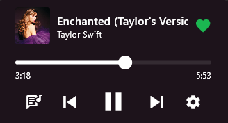
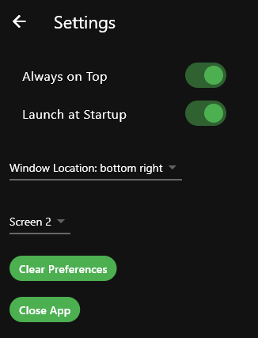

# Spotify Lyrics Display

This is a Flutter application that displays lyrics for the currently playing song on Spotify. It fetches lyrics from a specified source and syncs them with the song playback.

## Images
<p>
  
   
  
</p>

## How it Works

The application uses the Spotify API to get the currently playing song and its progress. It then fetches the lyrics for the song and scrolls through them in sync with the song playback. It also includes controls for resuming/pausing a song and skipping songs. In addition to options for starting on launch and always on top.

## Environment Variables

This application uses environment variables to manage sensitive data like the Spotify client ID and secret. These variables should be stored in a `.env` file in the root of your project.

Here's an example of what your `.env` file should look like:

```env
SPOTIFY_CLIENT_ID=your_client_id
SPOTIFY_CLIENT_SECRET=your_client_secret
```
Replace your_client_id and your_client_secret with your actual Spotify client ID and secret.

Note: Do not include the .env file in your version control system. Add .env to your .gitignore file to prevent it from being committed to your Git repository.

## Building the App

To build an executable file of this application for Windows, follow these steps:

1. Make sure you have Flutter installed on your machine. If not, you can download it from [here](https://flutter.dev/docs/get-started/install).

2. Clone this repository to your local machine:

```bash
git clone https://github.com/Lukebot19/spotify-disply-with-lyrics-flutter.git
```
3. Navigate to the project directory:
```bash
cd spotify-lyrics-display
```
4. Make sure you have enabled Windows desktop support in your Flutter installation:
```bash
flutter channel stable
flutter upgrade
flutter config --enable-windows-desktop
```
5. Build the Windows executable:
```bash
flutter build windows
```

After running these commands, you'll find the .exe file in the build\windows\runner\Release\ directory of your project.

## Pre-built Executable
If you don't want to build the app yourself, you can download the pre-built executable from the [Releases](https://github.com/Lukebot19/spotify-disply-with-lyrics-flutter/releases) page.

## Contributing
Contributions are welcome! Please feel free to submit a pull request.
## License
This project is licensed under the terms of the MIT license.